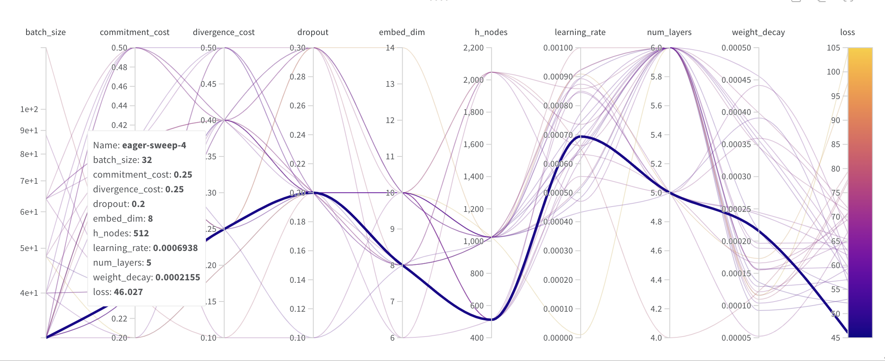
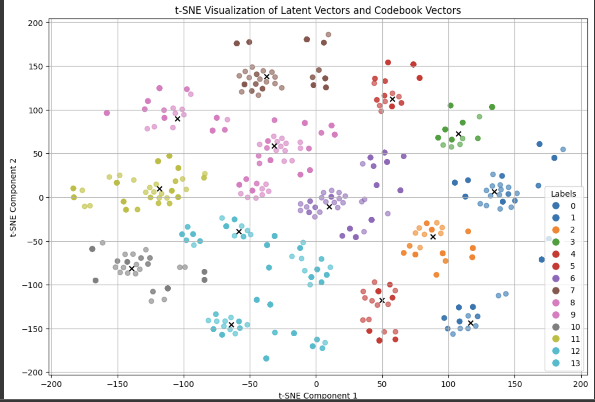
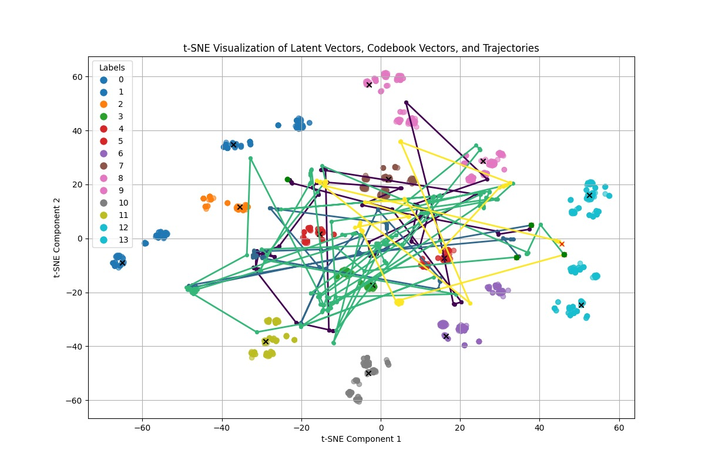
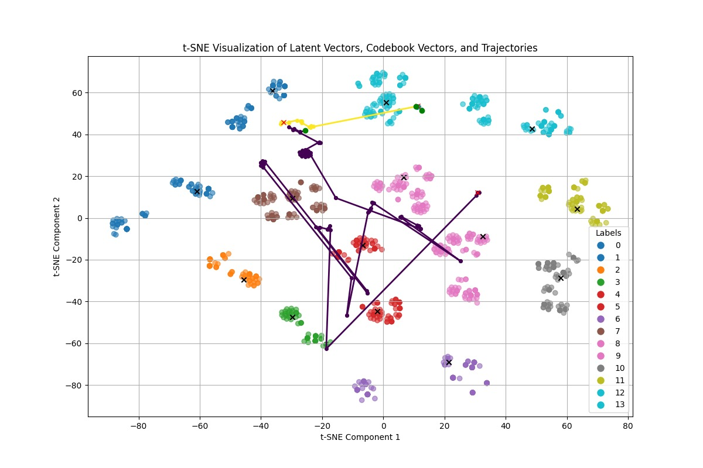
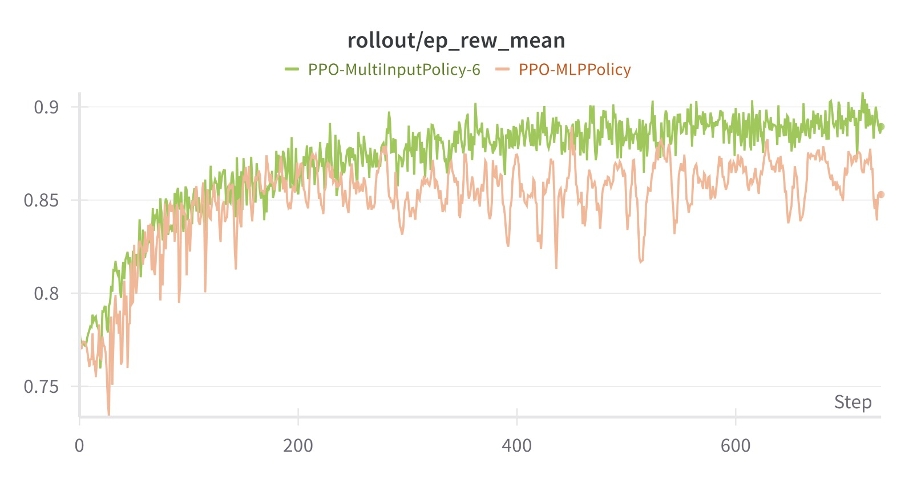
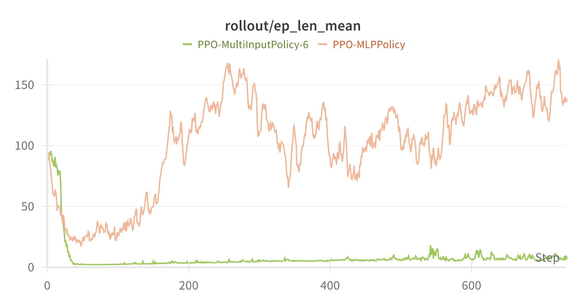

# Enhancing IBM's Analog NAS with RL agent
IBM's Analog-NAS is an innovative open-source project aimed at optimizing neural network
architectures for analog hardware, offering potential efficiency and performance advantages over
digital counterparts. However, exploring neural network architectures can be significantly
enhanced by incorporating advanced machine learning techniques like reinforcement learning
(RL).


## Setup

1. Clone this repository:

   ```bash
   git clone https://github.com/Sujeeth13/Analog_NAS.git
   ```

2. Install the dependencies:

   ```bash
   pip install -r requirements.txt
   ```

## Supervised VQVAE search space
- Open the [train_vqvae.ipynb](train_vqvae.ipynb)
- run all the cells except the ones marked as 'not required for training'
- Now the supervised VQVAE latent NAS search space weights are trained and saved.

#### Supervised VQVAE hyperparameter search (best params are highlighted)
<div style="display:flex">

</div>

#### Visualization of the latent NAS search space
<div style="display:flex">

</div>

## RL agent training
- Open the [train_RL_lab.ipynb](train_RL_lab.ipynb) 
- run all the cells to train and evaluate the agent

#### Training 


This project implements a novel NAS approach leveraging a Reinforcement Learning (RL) agent in combination with a Vector Quantized Variational AutoEncoder (VQ-VAE). The primary mechanism involves:

1. **State Representation**: The state of our RL agent is a latent vector derived from a supervised VQ-VAE model, effectively capturing the essence of various neural network architectures in a compressed format.

2. **Action Space**: At each decision step, the agent selects an action that involves choosing a specific vector from a learnt codebook and a dimension within that vector. This action modifies the corresponding dimension of the current state's latent vector to explore new architectural configurations.

3. **Decoding and Evaluation**: The updated latent vector is decoded back into a detailed architecture representation, which is then assessed by a surrogate model predicting the performance (accuracy) of the resultant architecture.

4. **Reward System**: The agent receives rewards based on the change in predicted accuracy between successive architectures, guiding it towards higher-performing neural network designs.

This approach harnesses the power of RL to systematically and efficiently explore the architecture space, driven by a surrogate model that estimates the potential success of generated designs. Our method promises a scalable and effective solution for automating the design of high-performing neural networks.

#### RL agent initial training trajectories

<div style="display:flex">


</div>

- Initial Training Phase Graphs, each colored line indicates a different trajectory. 
- Start of Trajectory is shown by green dot and end of trajectory by red cross.

#### Agent Evaluation Curves

Mean episode reward and length plots

<div style="display:flex">


</div>

## Team Members

- [Sujeeth Bhavanam](https://github.com/Sujeeth13)
- [Tawab Safi](https://github.com/asaficontact)